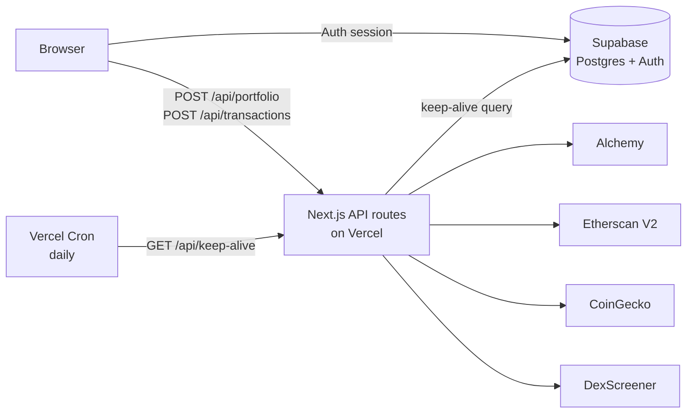

# Wallet Dashboard

A full-stack, multi-chain crypto portfolio tracker. Add any wallet address — hot wallets, cold wallets, Ledger, Trezor — and see balances, token holdings, portfolio allocation and recent transactions across 10 blockchains in one place.

**Live demo:** [wallet-dashboard-ten.vercel.app](https://wallet-dashboard-ten.vercel.app)


---

## Features

- **Multi-chain portfolio** — native and token balances across EVM chains, Solana and Tron, aggregated into a single total
- **Live pricing in USD and EUR** — CoinGecko for listed assets, DexScreener as a fallback for long-tail tokens
- **Portfolio allocation chart** — breakdown by chain and asset
- **Transaction history** per wallet
- **Wallet categories** — tag each address as hot or cold storage
- **Four sign-in methods** — email/password, Google, GitHub and MetaMask (Sign-In with Ethereum style)
- **Per-user data isolation** — each user only ever sees their own wallets, enforced at the database level

## Supported chains

| Chain | Data source |
|---|---|
| Ethereum | Etherscan V2 |
| Base | Etherscan V2 |
| BNB Chain | Alchemy |
| Polygon | Alchemy |
| Arbitrum | Alchemy |
| Optimism | Alchemy |
| Avalanche | Alchemy |
| Robinhood Chain (L2, chain ID 4663) | Alchemy |
| Solana | Alchemy, with public RPC fallback |
| Tron | TronGrid / Tronscan |

## Tech stack

| Layer | Technology |
|---|---|
| Framework | Next.js 15 (App Router), React 18, TypeScript |
| Styling | Tailwind CSS, Lucide icons |
| Charts | Recharts |
| Database & auth | Supabase (PostgreSQL + Supabase Auth) |
| Web3 | ethers.js (signature verification) |
| Blockchain data | Alchemy, Etherscan V2, CoinGecko, DexScreener, Jupiter token list |
| Hosting | Vercel (with Vercel Cron) |

## Architecture



All calls to blockchain and pricing APIs happen in **server-side API routes**, so provider API keys never reach the browser. The client only talks to Supabase (for auth and the user's wallet list) and to the app's own API.

## Technical decisions

**Row Level Security on every table.** The `wallets` table has RLS policies for select, insert, update and delete, all scoped to `auth.uid() = user_id`. Even though the browser holds a Supabase key, it can only ever read or modify the signed-in user's own rows.

**MetaMask authentication without a third-party provider.** The server issues a nonce signed with HMAC-SHA256 and a 5-minute expiry. The user signs it with their wallet, the server verifies the signature with `ethers.verifyMessage`, checks the HMAC and freshness, and then creates or signs in the Supabase user. This avoids storing nonces in the database while still preventing replay attacks.

**Resilient RPC access.** Solana and EVM native balances try Alchemy first and fall back to public RPC endpoints if it fails, so a single provider outage doesn't break the dashboard.

**Keeping the free tier alive.** Supabase pauses free-tier projects after a week without activity. A daily Vercel Cron job calls `/api/keep-alive`, which runs a lightweight query against the database. The route is protected by a `CRON_SECRET` bearer token so only Vercel can trigger it.

**Secrets management.** All keys live in Vercel environment variables. Server-only keys are stored as encrypted secrets; only values designed to be public (the Supabase URL and publishable key) use the `NEXT_PUBLIC_` prefix.

## Project structure

```
src/
├── app/
│   ├── (auth)/            # Login and register pages
│   ├── api/
│   │   ├── auth/          # MetaMask nonce + signature verification
│   │   ├── portfolio/     # Balances, tokens and prices across chains
│   │   ├── transactions/  # Transaction history
│   │   └── keep-alive/    # Daily cron endpoint
│   └── auth/callback/     # OAuth callback (Google, GitHub)
├── components/            # Overview, tokens, transactions, wallets, UI
├── context/               # Auth and app state
├── lib/                   # One module per data provider + chain config
└── middleware.ts          # Route protection
```

## Running locally

1. Clone the repo and install dependencies:
   ```bash
   git clone https://github.com/ManuelRCG777/Wallet_Dashboard.git
   cd Wallet_Dashboard
   npm install
   ```
2. Create a Supabase project and run `supabase_setup.sql` in the SQL Editor.
3. Create a `.env.local` file (never commit it) with:
   ```
   NEXT_PUBLIC_SUPABASE_URL=
   NEXT_PUBLIC_SUPABASE_ANON_KEY=     # Supabase publishable key
   SUPABASE_SERVICE_ROLE_KEY=         # Supabase secret key
   WEB3_NONCE_SECRET=                 # any long random string
   ALCHEMY_API_KEY=
   ETHERSCAN_API_KEY=
   CRON_SECRET=                       # only needed for the keep-alive route
   ```
4. Start the dev server:
   ```bash
   npm run dev
   ```

## Author

**Manuel Gomes** — [@ManuelRCG777](https://github.com/ManuelRCG777)
